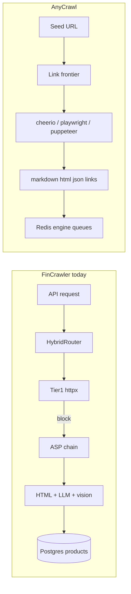
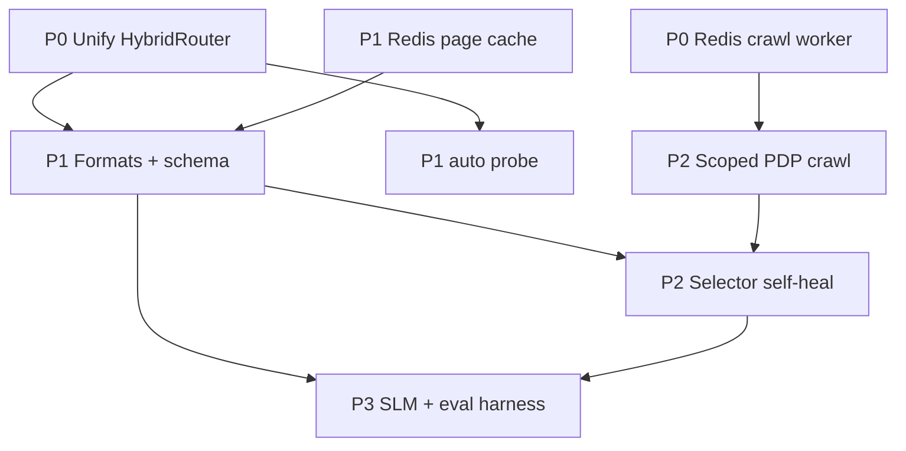

# FinCrawler × AnyCrawl × Research Learnings

Analysis of FinCrawler against [AnyCrawl](https://github.com/any4ai/anycrawl) and 2024–2026 crawling research. **No implementation in this document** — adopt/skip tags and the P0–P3 roadmap define what to build next.

---

## 1. Architecture comparison matrix

| Dimension | FinCrawler | AnyCrawl | Research best practice (2024–2026) |
|-----------|------------|----------|--------------------------------------|
| **Primary workload** | Targeted retailer/finance fetch + structured offers/quotes | General scrape, site crawl, SERP | Hybrid: discovery + semantic extraction |
| **Language / deploy** | Python FastAPI, single service + optional workers | Node/TS monorepo, Redis microservices | Language-agnostic; queue-separated engines |
| **URL supply** | API + source templates (`sources.search_url_template`) | Seed + link frontier (`max_depth`, path rules) | Utility-scored frontier (Craw4LLM), not PageRank |
| **Fetch engines** | Tier 1–4: httpx → curl_cffi → Playwright → ASP chain | `auto` / cheerio / playwright / puppeteer | Cheap HTTP first; escalate on JS-need *or* block |
| **Anti-bot** | First-class ASP (PerimeterX, DataDome, proxy pool, browser grid, circuit breakers, budget caps) | Proxy + stealth proxy credits; thinner in-process | Multi-tier stealth + health scoring |
| **Compliance** | Robots, per-domain rate limits, `crawl_events` audit | Lighter / config-driven | Ethics as first-class (SLR 2026) |
| **Output** | Domain structs (products/offers) + partial Firecrawl `/v1/scrape` | markdown, html, text, links, screenshot, json schema | Markdown-first + schema JSON for LLMs |
| **Extraction** | JSON-LD/CSS → text LLM → vision LLM | HTMLTransformer + optional LLM schema | Hybrid heuristics then LLM; self-heal selectors (AutoCrawler) |
| **Jobs / scale** | Browser-grid Redis only; `crawl_worker` is stub | Per-engine Redis queues + async crawl jobs | Horizontal workers + adaptive stop |
| **Cache** | In-memory `aiocache` (`cache.py`) | Page cache with `max_age` / `store_in_cache` | Shared Redis TTL cache |
| **Domain intelligence** | Normalize, match, rank, price history | Raw LLM-ready pages | Task-specific scoring of which pages to keep |

### Verdict in one line

FinCrawler **leads** on anti-bot and shopping/finance productization; AnyCrawl **leads** on general crawl UX (engines, formats, async site crawl, cache). Research says close the gap with hybrid pipelines, utility-based discovery, and evaluator harnesses — not a TypeScript rewrite.

---

## 2. Learning catalog

Each learning is tagged: **already have** | **adopt** | **skip**. File anchors point at the FinCrawler surface to change or preserve.

### 2.1 From AnyCrawl

| ID | Learning | Tag | File anchors | Notes |
|----|----------|-----|--------------|-------|
| A1 | Pluggable engines + Redis job queues for scrape/crawl | **adopt** | [`app/workers/crawl_worker.py`](../app/workers/crawl_worker.py) (stub today), [`app/services/browser_grid/`](../app/services/browser_grid/), new queue module under `app/services/` | Keep ASP as escalation layer; do not fork into cheerio/puppeteer workers — map to httpx / Playwright / ASP |
| A2 | `auto` engine: HTTP first, upgrade when JS needed | **adopt** | [`app/services/crawler/hybrid_router.py`](../app/services/crawler/hybrid_router.py), [`compliant_fetcher.py`](../app/services/crawler/compliant_fetcher.py) | Today escalation is mostly *block*-driven; add SPA/empty-body content signals |
| A3 | Site crawl API (`max_depth`, strategy, include/exclude, scrape_paths, job poll) | **adopt** (selective) | [`app/api/crawl_jobs.py`](../app/api/crawl_jobs.py), new frontier service | Shopping-shaped PDP discovery only — not open-web BFS |
| A4 | Multi-format LLM-ready output (markdown, links, html, json) | **adopt** | [`firecrawl_compat.py`](../firecrawl_compat.py) (formats mostly ignored), [`app/api/zenith_compat.py`](../app/api/zenith_compat.py) | Expand `/v1/scrape`; keep shop endpoints returning offers |
| A5 | HTMLTransformer (`include_tags`, `exclude_tags`, `only_main_content`) | **adopt** (general scrape) | New cleaner module; do **not** replace [`html_product_extractor.py`](../app/services/crawler/html_product_extractor.py) for retailers | Dual path: general main-content vs retailer extractors |
| A6 | Schema + `user_prompt` JSON extraction | **adopt** | [`llm.py`](../llm.py) (`extract_structured`), Firecrawl/Zenith request schemas | Optional `json_options` on scrape; keep shopping/finance system prompts as defaults |
| A7 | Page cache with `max_age` / `store_in_cache` | **adopt** | [`cache.py`](../cache.py) (MEMORY only; Redis swap commented) | Wire Redis; expose TTL on scrape APIs |
| A8 | SERP crawl (Google/Bing/Baidu) | **skip** | [`app/api/shop.py`](../app/api/shop.py) (Google Shopping already 410) | Shop search hits retailers directly |
| A9 | TS monorepo / per-engine Docker microservices | **skip** | [`Dockerfile`](../Dockerfile), [`docker-compose.yml`](../docker-compose.yml) | Borrow queue separation, keep Python FastAPI |
| A10 | Stealth proxy as paid credit mode | **already have** (ahead) | [`app/services/asp/`](../app/services/asp/), [`proxy_pool.py`](../app/services/asp/proxy_pool.py), [`ARCHITECTURE.md`](../ARCHITECTURE.md) | Richer than AnyCrawl; no change needed for parity |

### 2.2 From research (2024–2026)

| ID | Source | Learning | Tag | File anchors | Notes |
|----|--------|----------|-----|--------------|-------|
| R1 | [SLR Computing 2026](https://link.springer.com/article/10.1007/s00607-026-01666-5) | Agentic / self-repairing extractors when layouts change | **adopt** | [`html_product_extractor.py`](../app/services/crawler/html_product_extractor.py), [`profiles/retailers.json`](../profiles/retailers.json) | Persist healed selectors; avoid paying vision every failure |
| R2 | SLR 2026 | Hybrid pipelines beat LLM-only (heuristics first) | **already have** → formalize | [`shop_price_extract.py`](../shop_price_extract.py), HTML extractor → [`llm.py`](../llm.py) → [`vision_fetcher.py`](../app/services/crawler/vision_fetcher.py) | Add metrics: heuristic hit rate vs LLM/vision spend |
| R3 | SLR 2026 | SLMs for domain-specific extraction; cost/concurrency | **adopt** (P3) | [`llm.py`](../llm.py) (`_llm_semaphore = Semaphore(1)`) | Raise concurrency carefully; consider small product-field model |
| R4 | SLR 2026 | Evaluation with F1 + operational SLOs | **adopt** (P3) | [`app/tests/`](../app/tests/), golden HTML fixtures under `app/tests/fixtures/` | Not just “got a price” |
| R5 | SLR 2026 | Ethics / legal as first-class | **already have** | [`robots_service.py`](../app/services/robots_service.py), [`rate_limiter.py`](../app/services/rate_limiter.py), [`crawl_events` model](../app/models/), [`compliance_checker.py`](../app/services/compliance_checker.py) | Keep as differentiator vs AnyCrawl |
| R6 | [AutoCrawler](https://arxiv.org/abs/2404.12753) | Top-down DOM prune → execute → step-back; write reusable selectors | **adopt** (P2) | Extractor + `profiles/retailers.json` | Bounded agent, not unbounded browser agent |
| R7 | [Craw4LLM](https://aclanthology.org/2025.findings-acl.712/) | Prioritize URLs by task utility (~21% crawl volume for same quality) | **adopt** (P2, with A3) | New frontier / URL scorer; retailer templates in [`scripts/seed_sources.py`](../scripts/seed_sources.py) | Score “likely PDP / has price-GTIN”, not BFS depth |
| R8 | Crawl4AI / Firecrawl industry patterns | Markdown-first + adaptive stop-on-confidence | **adopt** (partially via A4 + A3) | Firecrawl compat + frontier | Anti-bot depth already matched |

### 2.3 Internal FinCrawler gaps (blocking adoption)

| ID | Issue | Tag | File anchors |
|----|-------|-----|--------------|
| F1 | Dual fetch stack: legacy `crawler.crawl_single` → missing `tier_router`; modern path is `HybridRouter` | **adopt** (P0 unify) | [`crawler.py`](../crawler.py), [`firecrawl_compat.py`](../firecrawl_compat.py), [`app/services/crawler/hybrid_router.py`](../app/services/crawler/hybrid_router.py), [`app/main.py`](../app/main.py) |
| F2 | `crawl_worker` sleeps forever | **adopt** (P0) | [`app/workers/crawl_worker.py`](../app/workers/crawl_worker.py) |
| F3 | Schema via `create_all` only; no Alembic | **skip** for this learning track | [`app/database.py`](../app/database.py) | Track separately if schema evolves for jobs/frontier |
| F4 | Prefetch scheduler disconnected from app lifespan | **skip** (unless re-warm needed) | [`prefetch.py`](../prefetch.py) |

---

## 3. Prioritized adoption roadmap

Effort: **S** (~1–2 days), **M** (~3–5 days), **L** (~1–2 weeks). Impact: **H** / **M** / **L** on product goals (shop reliability, cost, API parity).

| Priority | Item | Learning IDs | Effort | Impact | Why | Primary touch points |
|----------|------|--------------|--------|--------|-----|----------------------|
| **P0** | Unify legacy vs `app/` fetch paths | F1 | M | H | Firecrawl/legacy callers bypass ASP/compliance; `tier_router` import is fragile | `crawler.py`, `firecrawl_compat.py`, `app/main.py` → route through `HybridRouter` |
| **P0** | Real Redis crawl-job worker | A1, F2 | M | H | Unlocks async scrape/crawl like AnyCrawl; browser grid already proves Redis pattern | Replace stub in `crawl_worker.py`; add queue + status API beside `crawl_jobs.py` |
| **P1** | Multi-format scrape (`markdown`, `links`, schema JSON) | A4, A5, A6, R8 | M | H | LLM-ready + Firecrawl parity without changing shop offer APIs | `firecrawl_compat.py`, Zenith routers, new HTML→markdown cleaner |
| **P1** | Redis page cache (`max_age`) | A7 | S | M | Cut repeat cost/latency; Redis already in compose | `cache.py` → Redis; wire into scrape path |
| **P1** | `auto` content probe before browser/ASP | A2 | S–M | H | Save ASP budget on static pages; escalate on JS-need *and* blocks | `hybrid_router.py` |
| **P2** | Product-signal URL prioritization + scoped PDP crawl | A3, R7 | L | M | Craw4LLM-style efficiency for retailer catalog discovery | New frontier service; retailer path templates |
| **P2** | Extractor self-heal into profiles | R1, R6 | M–L | H | Cut recurring LLM/vision spend when selectors break | `html_product_extractor.py`, `profiles/retailers.json` |
| **P3** | SLM / higher LLM concurrency + eval harness | R3, R4, R2 metrics | L | M | Research cost/quality trend; safer to raise semaphore with fixtures | `llm.py`, `app/tests` golden fixtures |
| **Skip** | Full SERP engines | A8 | — | — | Out of product scope | — |
| **Skip** | TS monorepo rewrite | A9 | — | — | Low ROI | — |
| **Skip** | Thin stealth-proxy-only model | A10 | — | — | Already ahead | — |

### Suggested build order (dependencies)

### Explicit non-goals (this track)

- Porting AnyCrawl TypeScript packages
- Broad open-web crawling unrelated to shopping/finance
- Replacing the ASP stack with AnyCrawl’s thinner proxy model

---

## 4. Sources

| Source | Role |
|--------|------|
| [any4ai/anycrawl](https://github.com/any4ai/anycrawl) + [docs](https://docs.anycrawl.dev/) | Engine/queue/format/site-crawl patterns |
| [LLMs applied to web scraping and crawling (SLR)](https://link.springer.com/article/10.1007/s00607-026-01666-5) (Computing, 2026) | Field trends: hybrid, agentic, SLM, ethics |
| [AutoCrawler](https://arxiv.org/abs/2404.12753) | Progressive DOM understanding / crawler generation |
| [Craw4LLM](https://aclanthology.org/2025.findings-acl.712/) (ACL Findings 2025) | Utility-based URL prioritization |
| FinCrawler tree | `app/services/crawler/`, `app/services/asp/`, `ARCHITECTURE.md`, legacy root modules |

---

## 5. Summary

| Keep / double down | Adopt next | Do not chase |
|--------------------|------------|--------------|
| ASP + compliance audit | ~~P0 unify + real crawl worker~~ **done** | SERP engines |
| Hybrid HTML → LLM → vision | ~~P1 formats, Redis cache, auto probe~~ **done** | TS monorepo |
| Product normalize/rank DB | ~~P2 utility PDP crawl + selector self-heal~~ **done** | Open-web BFS |
| | ~~P3 eval harness + LLM concurrency~~ **done** | Replacing ASP with thin proxy |

### Implementation status (2026-07-11)

| Priority | Status | Notes |
|----------|--------|-------|
| P0 Unify HybridRouter | Done | [`crawler.py`](../crawler.py) → `HybridRouter`; Firecrawl uses same path |
| P0 Redis crawl worker | Done | [`app/workers/crawl_worker.py`](../app/workers/crawl_worker.py), [`app/services/crawl_jobs/`](../app/services/crawl_jobs/), `POST /crawl-jobs/enqueue` |
| P1 Multi-format scrape | Done | [`html_transformer.py`](../app/services/crawler/html_transformer.py), expanded [`firecrawl_compat.py`](../firecrawl_compat.py) |
| P1 Redis page cache | Done | [`cache.py`](../cache.py) auto Redis + `max_age` |
| P1 auto JS probe | Done | [`js_probe.py`](../app/services/crawler/js_probe.py) in HybridRouter |
| P2 Scoped PDP crawl | Done | `POST /crawl-jobs/pdp-crawl`, [`product_frontier.py`](../app/services/crawler/product_frontier.py) |
| P2 Selector self-heal | Done | [`selector_healer.py`](../app/services/crawler/selector_healer.py) via shop extract |
| P3 Eval + LLM concurrency | Done | `LLM_MAX_CONCURRENCY`, [`test_extraction_eval.py`](../app/tests/test_extraction_eval.py) |

Still **out of scope**: porting AnyCrawl TypeScript, broad open-web crawling.
